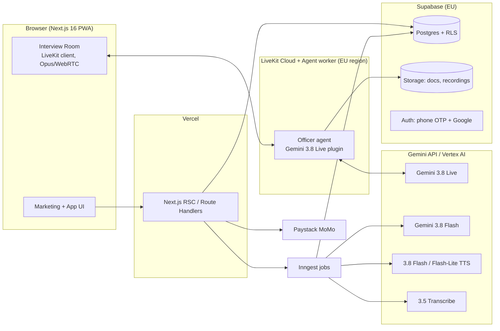

# Okwan: product, engineering, design and SEO plan

**What it is:** an interview simulator for Ghanaians applying for US visas. You upload your documents, then you practise with a simulated consular officer who has "read your DS-160" and questions you the way it happens at the window in Accra. After each session you get an honest debrief.

**Status:** research and decision document, written 25 Sep 2026. Every figure below has its source linked in the [Sources](#sources) section. Where a source is a weak blog rather than a primary source, this document says so.

---

## 0. TL;DR (the decisions)

| Area | Decision |
|---|---|
| **Name** | **Okwan** (Twi for *the way / the road*). `okwan.ai` is the primary domain. `okwan.app` and `getokwan.com` redirect to it. All three were available on 25 Sep 2026. See §9. |
| **Core bet** | Don't build a question-bank chatbot. Build the **2.5-minute interview itself**: an officer who has read your case, interrupts you, and ends the interview the way real officers do. Then give a debrief grounded in your own documents. |
| **Wedge** | Start with F-1 (81% refusal rate for Ghana in 2025) and B1/B2 (64.3% refusal rate, plus a $10k–$20k visa bond). Add J-1, then others. |
| **Live officer voice** | **Gemini 3.8 Live**, a native speech-to-speech model: about 1.2 s to first audio, built-in barge-in, about $0.02–0.03 of audio per minute. |
| **Gemini 3.8 Flash TTS** | **Relevant, but not for the live conversation.** It takes about 13 s to first token. Use it for pre-rendered officer audio: the drill library, offline practice, "hear a strong answer", and marketing demos. See §3. |
| **Transcripts and delivery analysis** | **Gemini 3.5 Transcribe** runs after the interview. It gives word timestamps for pause and pace analysis. Users can correct their transcript, because West-African-accented ASR is still error-prone. |
| **Stack** | Next.js 16 on Vercel, Supabase (Postgres, RLS, Storage, Auth), LiveKit Cloud (WebRTC/Opus) with a Gemini Live agent worker, Inngest for jobs, Paystack for Mobile Money, and PostHog plus Sentry. |
| **Pricing** | An **Interview Pass** (one-time payment, valid until your interview date) paid with MoMo. No subscription, because a visa interview is a one-time event. There is a free Case Scan and a free short mock. |
| **Trust rule** | We never promise approval, never write fake answers, and never imply US government affiliation. Real results come from rehearsing *your own true case* until you can say it clearly in 20 seconds. |
| **Design** | One idea runs through the whole brand: **the window**. The look is editorial, cinematic and warm, with Ghanaian photography from a commissioned shoot, one signature interaction, and a performance budget that still passes Core Web Vitals on a mid-range Android on MTN 4G. |
| **SEO/GEO** | First-party data is the moat: a live Accra wait-time tracker, a database of reported questions, and guides reviewed by former consular officers. Pages open with direct answers and use structured data and strong entity signals. Treat `llms.txt` as optional; Google doesn't use it. |

---

## 1. The market reality (why this can work, and what "results" must mean)

**The pain is severe and measurable:**

- **F-1 refusals in Ghana hit a record 81% in 2025**, up from 72% in 2024. Meanwhile, Ghanaian enrolment in the US grew 36.5% to 12,825 students in 2024/25. Demand is high and success is rare. ([ICEF Monitor](https://monitor.icef.com/2026/04/visa-rejections-climb-in-the-us-for-international-students-from-key-markets-including-india/), [Yen.com.gh](https://yen.com.gh/people/302892-us-releases-list-countries-highest-student-visa-refusal-rates-ghana-unenviable-score/))
- **The B1/B2 refusal rate for Ghana was 64.3% in FY2025**, against a 27.8% global average. ([Alma](https://www.tryalma.com/learn/visa-denial-rate-statistics)) This is a secondary aggregator, so check it against State Dept 214(b) tables before quoting it in marketing.
- **The visa bond became permanent on 3 Aug 2026** at $10k, $15k or $20k, and Ghana is on the list. The cost of a weak visitor-visa case is now enormous. ([Yen.com.gh](https://yen.com.gh/world/us/309108-us-lists-10-west-african-countries-citizens-face-20000-visa-bond/), [BAL](https://www.bal.com/immigration-news/united-states-38-countries-now-subject-to-state-departments-visa-bond-requirements/))
- **Social-media vetting:** student applicants must set their accounts to public before the interview. ([GhanaWeb](https://www.ghanaweb.com/GhanaHomePage/business/Why-the-US-Embassy-requires-access-to-social-media-for-student-visa-applications-1988975))
- **Five-year multiple-entry visas were restored for Ghana on 26 Sep 2025**, after the July 2025 single-entry restriction was lifted. A good outcome is worth more again. ([Ghana MFA](https://mfa.gov.gh/index.php/reversal-of-u-s-visa-restrictions-on-ghana/), [ISD](https://isd.gov.gh/us-lifts-visa-restrictions-on-ghana-restores-5-year-multiple-entry-visas/))
- **Fees:** the $185 MRV fee is non-refundable, and the new $250 "visa integrity fee" is being rolled out on issuance. A refusal costs real money, which anchors our pricing. ([Manifest Law](https://manifestlaw.com/blog/immigration/news/visa-integrity-fee/), [BU ISSO](https://www.bu.edu/isso/2026/05/19/visa-integrity-fee/))
- **Appointment scarcity:** the embassy released about 1,000 extra B1/B2 slots in Feb 2026 because demand was so high. ([The Voice of Africa](https://thevoiceofafrica.com/2026/02/18/u-s-embassy-in-ghana-opens-1000-new-visa-interview-slots-amid-high-demand/))

**How the interview actually works:**

- Officers get **about 2.5 minutes per applicant**. ([Kuck Baxter](https://immigration.net/2026/08/10/why-your-visa-interview-is-only-2-5-minutes-long/), [Boundless](https://www.boundless.com/immigration-resources/preparing-for-travel-visa-interview))
- The **DS-160 is always reviewed**. Supporting documents are often **not looked at**. ([Boundless](https://www.boundless.com/immigration-resources/form-ds-160-explained))
- Most refusals are **INA 214(b)**: the applicant failed to overcome the presumption of immigrant intent. A 214(b) refusal can't be appealed. Only a materially stronger case changes the outcome on reapplication.

**What this means for the product:**

1. Documents matter mainly because **your spoken answers must match your DS-160 and your paperwork**, and because they show *where the officer will probe*. The uploaded documents feed the simulator. We don't build a document-review service.
2. The skill we train is **saying a true, strong case in 1–3 sentences, under pressure, in about 2.5 minutes**. Long answers, memorised scripts, hesitation and inconsistency are what get applicants refused.
3. **"Real results, not snake oil"** means:
   - never predict approval
   - never generate fabricated answers
   - be honest when a case is weak ("your funding doesn't cover year 1 on the I-20; practising won't fix that")
   - measure outcomes transparently (see §7)

   Coaching someone to misrepresent facts exposes them to a **permanent misrepresentation bar**, INA 212(a)(6)(C)(i). The product has to protect users from that.

**Competitors:** VisaInterview.ai, MockVisa, Permito, Visavi, YMGrad and Matherium ([Permito's roundup](https://permito.ai/blog/best-ai-mock-interview-tools-visa-2026), [VisaInterview roundup](https://www.visainterview.ai/blog/best-ai-visa-interview-prep-tools-2026)). They are all generic, India-first, F-1 question banks with text or voice feedback. **None of them is built around a Ghanaian applicant's actual documents, the Accra post, cedi pricing with MoMo, or the visa bond.** Local human consultants charge around $150 for an hour-long mock ([Gumroad example](https://globalvisashelp.gumroad.com/l/StudentVisaDeepDiveDocumentsInterviewPrep)), and quality varies a lot. That gap is the opening.

---

## 2. Product: the features that do the job

The product has four parts: **Case, Window, Debrief and Readiness.** Each one exists because of a fact in §1.

### 2.1 Case File (upload → structured case)
- The user uploads their documents:
  - DS-160 confirmation or answers
  - I-20 or DS-2019, and the admission letter
  - bank statements and the sponsor letter
  - employment letter or business registration
  - property and family ties
  - invitation letter (B1/B2)
  - prior refusal letters
  - the travel history page from the passport
- Gemini 3.8 Flash (multimodal, structured output) extracts a **Case Profile** into a Zod-validated schema: purpose, program, cost vs. funds, sponsor and relationship, ties, travel history and prior refusals.
- The user confirms or corrects every extracted field. **This confirmed profile is the only source of truth** that later coaching may use.
- **Case Scan** (free, and the lead magnet) lists the questions the officer is most likely to press on. It never gives an approval probability. Examples:
  - **Funding gap:** I-20 year-1 cost is more than the documented liquid funds.
  - **Large recent deposit:** a lump sum was deposited shortly before the application.
  - **Unclear sponsor:** the sponsor's relationship or income isn't clear.
  - **Program doesn't fit the career:** e.g. a mid-career banker going to a generic MBA with no plan to return.
  - **DS-160 mismatch:** the documents contradict the DS-160 (dates, employer, address).
  - **Visitor-visa costs:** B1/B2 visa bond exposure and the $250 integrity fee.
  - **Social-media vetting:** a reminder to set accounts to public (F/M/J).
  - **Prior refusal with nothing changed:** a 214(b) refusal and no new evidence since.

### 2.2 The Window (the simulation) — this is the product
- **It feels like the real thing:**
  - The interview is full-screen and minimal.
  - The officer's voice comes "through the glass", with a light room-tone and queue ambience you can switch off.
  - The applicant stands. We prompt this, because posture changes how people speak.
  - There is **no pause button** in "Real mode". A practice mode with hints exists separately.
- **The officer knows your case.** The system prompt holds the Case Profile. The officer opens with what they're really asking about ("Why this university?", "Who is paying?", "What does your father do?") and follows up on weak points found by the Case Scan.
- **The officer interrupts (barge-in) and ends the interview abruptly.** A session lasts 90 s to 4 min, then ends with one of three outcomes:
  - "Your visa is approved" (the officer keeps the passport)
  - a 221(g) slip
  - a 214(b) refusal sheet

  The debrief explains why. This outcome is a **training signal, not a prediction**, and the UI says so.
- **Officer personas** are calibrated from documented interviewing styles, not caricatures:
  - *Brisk* (question after question)
  - *Sceptical* (probes the numbers)
  - *Friendly-but-thorough*
  - *Silent* (long pauses to test composure)

  The **2–4 personas** are reviewed by former consular officers acting as paid advisors (§7).
- **Visa types at launch:** F-1 and B1/B2. Later: J-1, then H-1B/L-1 and K-1, and DV immigrant-visa interviews (DV interviews are a different format, so they're a separate module).
- **Camera is optional.** With consent, 1 fps frames give feedback on eye contact and composure. Audio plus video Live sessions are capped at 2 min unless context compression is on. We turn compression on, but audio-only is the default so the experience is lighter on data.

### 2.3 Debrief (feedback you can act on)
Each answer gets:
- **What the officer was really testing:** intent, ties, funding, purpose or credibility.
- **Scores for:**
  - directness (did the first sentence answer the question?)
  - specificity (names, numbers, dates)
  - consistency with your Case Profile and earlier answers
  - length (seconds and words; aim for under about 20 s)
  - delivery: fillers, long pauses and pace, taken from word timestamps
- **Red-flag detection.** Examples: "I'll look for a job there", "My uncle will pay" (with no documented uncle), "I'm not sure yet".
- **"Your answer, stronger":** a rewrite that may use **only facts from your confirmed profile**. If the true case is weak, the rewrite says what evidence is missing and doesn't invent it. A validator enforces this. It blocks any rewrite that adds entities, numbers or relationships that aren't in the profile.
- **Replay:** your recording plays alongside the transcript. You can re-record just that answer (a spaced-repetition drill).

### 2.4 Readiness (progress that is honest)
- **The Readiness score** covers the last N Real-mode sessions, across **at least two personas**, and weights consistency over time. It is designed to be hard to game, because repeating the same persona doesn't raise it.
- **The Consistency tracker** flags contradictions across sessions. Example: the sponsor was "father" on Tuesday and "uncle" on Thursday. In the real interview, this kind of contradiction is fatal.
- **Countdown plan:** the user enters an interview date and gets a short daily plan, e.g. "3 min a day, 1 full mock every 2 days, a dress rehearsal 48 h before".
- **Day-of guide for the Accra embassy:** logistics, what to bring, timing and composure. It links to the official pages and doesn't replace them.

### 2.5 Things that make Ghanaians choose it (and tell friends)
- **Priced in cedis and paid with MoMo** (MTN MoMo, Telecel Cash, AirtelTigo Money) through Paystack. Mobile money dominates payments in Ghana. ([Paystack by country](https://www.mctaba.com/learn/paystack/paystack-by-country-nigeria-ghana-south-africa-kenya-rwanda-cote-d-ivoire))
- **Low-data mode.** It is audio-only, uses Opus over WebRTC (§4.3), and shows the expected data cost before a session. Drills can be downloaded and practised offline, using the pre-rendered TTS audio.
- **WhatsApp companion** (phase 2): a daily "officer question" as a voice note, answered by voice note and graded. WhatsApp is how Ghana communicates.
- **Parents mode (B1/B2):** a lot of B1/B2 applicants are parents visiting children abroad. Offer a bigger type size, a slower-paced officer, and a helper can set it up for them. Twi/Ga/Ewe explanations appear in the debrief only; the interview itself stays in English, as at the window.
- **The share moment:** after an approval, the user can share an optional "Approved ✅" card to their WhatsApp Status. In Ghana, approval news spreads fast; this makes it a referral. Referral credit is paid in MoMo.
- **Refused before? track:** covers what a 214(b) refusal means, what has *materially* changed, and whether reapplying now makes sense. Sometimes the honest answer is "wait". That honesty builds trust.

### 2.6 Explicitly **not** doing
- Approval-probability percentages
- "Guaranteed visa" claims
- Answer scripts to memorise
- Anything that fills in or edits the DS-160 for the user (that's legal-practice and misrepresentation territory)
- US-government seals, flags as a trust device, or "embassy" in the brand name

---

## 3. Gemini 3.8 Flash TTS: is it relevant?

**Yes, as a supporting model. It is the wrong tool for the live officer.**

**What it is:**
- It was released in September 2026, together with **3.8 Flash-Lite TTS**, in the Gemini API and AI Studio.
- It ranks #1 on Hume AI's Overall Quality Index. Flash-Lite is #2.
- **2,000+ voices**, and voice design from a text prompt
- **Inline audio tags:** emotion, pace and accent can be set sentence by sentence
- **Native two-speaker scenes**
- **130 languages**
- **Voice cloning from 30 s of audio**, gated by a spoken consent clip from the same speaker
- **SynthID watermark and C2PA credentials**

**Cost:** $0.50/M text-input tokens and **$9.00/M audio-output tokens**, about **$0.81 per hour of audio**. Both rates **double on 1 Jan 2027**. Flash-Lite charges $6.00/M for audio output. The catch is **time to first token of about 13.3 s**, against a median of about 3 s. Sources: [Google blog](https://blog.google/innovation-and-ai/models-and-research/gemini-models/gemini-3-8-text-to-speech/), [tbreak](https://tbreak.com/gemini-3-8-flash-tts-voice-cloning/), [The Next Web](https://thenextweb.com/news/gemini-tts-3-8-flash-voice-design-cloning), [eesel pricing](https://www.eesel.ai/blog/gemini-3-8-flash-tts-pricing), [Artificial Analysis](https://artificialanalysis.ai/models/releases/gemini-3-8-flash).

A 13 s silence before every officer question would ruin the simulation. For the real-time conversation, use **Gemini 3.8 Live** instead:
- 1.18 s to first audio
- barge-in built in
- background tool calls
- 16 kHz PCM in, 24 kHz PCM out
- $3/M audio-in tokens (≈ $0.005/min) and $12/M audio-out tokens (≈ $0.018/min)
- audio-only sessions capped at 15 min without compression

A 4-minute mock costs **well under $0.15** in model audio. Sources: [SiliconANGLE](https://siliconangle.com/2026/09/15/googles-new-speech-model-gemini-3-8-live-supports-real-time-reasoning/), [MarkTechPost](https://www.marktechpost.com/2026/09/15/google-releases-gemini-3-8-live-and-3-8-live-extended-thinking-for-production-grade-voice-agents/), [Developers Digest](https://www.developersdigest.tech/blog/gemini-3-8-live-extended-thinking-release-guide-2026), [Google Cloud guide](https://docs.cloud.google.com/gemini-enterprise-agent-platform/models/guides/gemini-3-8-live).

**Where 3.8 Flash TTS earns its place:**
1. **The drill library.** Thousands of officer questions are pre-rendered once, in several personas, with audio tags such as `[flat, brisk]` or `[slight pause]`, then cached in storage or a CDN. Drills start instantly, work offline, and cost almost nothing per play.
2. **"Hear it said well."** A strong answer, built only from the user's own facts, is read back so they can copy the delivery (shadowing). There is an optional experiment: the same answer **in the user's own cloned voice**, which requires their spoken consent through Google's consent check. Hearing yourself sound confident is a known confidence-builder. Keep it opt-in and delete the voice on request.
3. **Two-speaker example interviews** for SEO and marketing pages, clearly labelled as simulated: officer and applicant, with a good and a bad version. This content is very shareable on TikTok and YouTube Shorts.
4. **Onboarding and day-of-guide narration** for parents mode and for users with low literacy.

**Use Flash-Lite TTS** for bulk renders (the drill library) and **Flash TTS** for the hero and demo content. **Never** clone the voice of a real officer or a public figure.

**Model split:**

| Job | Model |
|---|---|
| Live officer | Gemini 3.8 Live. Use 3.8 Live Extended Thinking only for a "hard mode" persona, if its latency holds up. |
| Pre-rendered speech | 3.8 Flash TTS and Flash-Lite TTS |
| Post-session transcript, word timestamps, diarisation | Gemini 3.5 Transcribe: about $0.005/audio-min, 2.6% WER non-streaming on AA English ([eesel](https://www.eesel.ai/blog/gemini-3-5-transcribe), [OpenRouter](https://openrouter.ai/google/gemini-3.5-transcribe)) |
| Document extraction, debrief grading, rewrites | Gemini 3.8 Flash with structured output |

Keeping one vendor keeps it to one DPA and one bill, with low latency between the models. Optional: run a second model family as an offline judge to calibrate grading drift.

> **Accent risk.** Benchmarks put **West-African-accented English at about 30% mean WER** across ASR systems ([AfriSpeech-MultiBench](https://arxiv.org/abs/2511.14255)), far worse than the 2–3% on standard corpora.
>
> **Mitigations:**
> - Gemini Live works on the audio directly, so it is more accent-robust than a speech-to-text-then-LLM pipeline.
> - Users can correct their transcript before it's graded.
> - Delivery is never scored on words the ASR probably got wrong.
> - From day one, build an **internal Ghanaian-English eval set**, sourced with consent, and gate every model upgrade on it.

---

## 4. Engineering

### 4.1 Architecture

### 4.2 Stack decisions

| Layer | Choice | Why |
|---|---|---|
| Web framework | **Next.js 16** (App Router, **Cache Components / PPR**, Turbopack, React Compiler), TypeScript | Marketing pages are static and edge-cached, which is what SEO needs, while the app shell is dynamic. One codebase. ([Next.js 16](https://nextjs.org/blog/next-16)) |
| Hosting | **Vercel** | Edge CDN close to West Africa via EU PoPs, preview deploys, Speed Insights for real-user CWV. |
| Styling / motion | Tailwind CSS v4, Motion, CSS scroll-driven animations, View Transitions API | The award-level motion lives in CSS and on the compositor so INP stays low (§5, §6). |
| Realtime | **LiveKit Cloud + LiveKit Agents (Gemini Live plugin)** | See §4.3. ([LiveKit Gemini plugin](https://docs.livekit.io/agents/models/realtime/plugins/gemini/)) |
| DB / Auth / Storage | **Supabase** (Postgres, Row-Level Security, Storage, Auth with phone OTP and Google) | Sensitive documents sit behind RLS. One vendor for three needs. Use an EU region (lowest latency to Accra over the submarine cables). |
| Jobs | **Inngest** | Durable multi-step pipelines: extract → validate → Case Scan, and transcribe → grade → rewrite → validate. |
| Payments | **Paystack** | Covers MoMo (MTN, Telecel, AirtelTigo) and cards, and settles in GHS. |
| Observability | **PostHog** (product analytics, flags, session replay with PII masking), **Sentry**, Vercel Speed Insights | |
| Email / WhatsApp | Resend for email. WhatsApp Cloud API in phase 2. | |
| Validation | Zod schemas are shared between LLM structured output, APIs and the DB | One schema per concept, so LLM output can't drift. |
| Testing | Vitest, Playwright (a sandboxed Chromium is available), and an **LLM eval suite** (golden cases, a Ghanaian-accent audio set, and grading-consistency checks) in CI | "Real results" starts with measured model behaviour. |

### 4.3 Why LiveKit (WebRTC) rather than a raw browser → Gemini WebSocket
- Gemini Live expects **16-bit PCM at 16 kHz in and 24 kHz out**. That's roughly **2 MB/min up and 3 MB/min down**, or about 20 MB for a 4-minute mock, and it runs over TCP, which stalls on lossy mobile links.
- **WebRTC with Opus** uses roughly 24–32 kbps each way (about 0.2–0.25 MB/min). It handles jitter and packet loss, and it has echo cancellation and noise suppression built in. For users on MTN or Telecel 4G, that difference *is* the product.
- The agent worker runs next to Google. It converts Opus to PCM, keeps the system prompt and the Case Profile **server-side** (they are never exposed to the browser), records both tracks for the debrief, and enforces session limits.
- **Fallback:** the Gemini Live WebSocket connected directly from the browser, using **ephemeral tokens locked to the config**. This is useful for a prototype in week 1. ([Ephemeral tokens](https://ai.google.dev/gemini-api/docs/live-api/ephemeral-tokens), [session management](https://ai.google.dev/gemini-api/docs/live-session))
- Turn on **session resumption**, so a dropped connection resumes within 24 h, and **context-window compression**, so sessions aren't capped at 15 min.
- **Measure from Accra** before choosing regions. Candidates are europe-west for Gemini and Vertex, and the EU for LiveKit and Supabase. Budget: under 1.5 s from the end of the user's speech to the officer's first audio, at the 75th percentile, on 4G.

### 4.4 Data model (core tables)
- `profiles`: user, phone, locale
- `cases`: visa type, interview date, confirmed profile JSON, version
- `documents`: storage path, type, extraction JSON, `delete_after`
- `sessions`: case, persona, mode, outcome, duration, recording paths
- `turns`: session, officer question, user transcript (raw and corrected), timestamps, scores JSON, red flags
- `rewrites`: turn, text, validator verdict
- `readiness_snapshots`
- `purchases`: Paystack reference, pass type, `valid_until`
- `outcomes`: self-reported result after the real interview, reported questions, consent to aggregate

RLS rule: a user sees only their own rows. Admin and advisor access is time-boxed and audited.

### 4.5 Security, privacy, compliance
- **Register with Ghana's Data Protection Commission within 20 days of starting business**, under Act 843, and renew every two years. Penalties for failing to register include fines and imprisonment. ([DPC](https://dataprotection.org.gh/registration/), [ITLawCo](https://itlawco.com/focus-areas/data-protection-and-privacy/ghanas-data-protection-act-2012-act-843/))
- **Minimise data:**
  - Extract the fields we need, then **delete the raw documents after 30 days by default**. The user can choose "delete now".
  - Mask passport numbers at extraction.
  - Never send documents to analytics or session replay.
- Encrypt data at rest (Supabase) and use signed short-lived URLs. Recordings are private and deletable.
- Use the **paid Gemini API tier or Vertex AI**, where prompts aren't used for training. Confirm this in the current terms and name it in the privacy notice.
- Applicants aged 17 and under need a guardian consent flow.
- Voice cloning (optional feature): take a consent recording through Google's gate, keep a store of voices that's easy to delete, and never share it.
- Legal copy has to say three things clearly:
  - we are not a law firm and not affiliated with the US government
  - simulated outcomes are not predictions
  - we don't complete visa forms

### 4.6 Unit economics (rough, per paid user)
Assume 8 full mocks at 4 min, 40 drills, transcription, grading and extraction:
- Live audio ≈ $1.00
- Transcription ≈ $0.20
- Grading and extraction ≈ $0.30
- LiveKit ≈ $0.30

**Total: under about $2 per user**, before TTS doubles in 2027. The drill audio is pre-rendered once and shared. Gross margin at the suggested price is above 85%.

---

## 5. Design direction: built to win

Awwwards judges on design, usability, creativity and content. The CSSDA, FWA and Webby awards look for similar things. Award winners in 2026 favour immersive, scroll-driven storytelling with a distinct point of view, even in fintech: Jeton won Site of the Day for exactly that combination ([Really Good Designs](https://reallygooddesigns.com/web-design-trends-2026/), [Awwwards](https://www.awwwards.com/websites/)). Our point of view is simple and emotional.

### 5.1 The concept: *The Window*
Every Ghanaian applicant pictures the same moment: standing at the glass, and the officer glancing up from the DS-160. The brand turns that moment from fear into readiness.

- **The hero is an interactive window.** The glass starts frosted. When you tap "Ask me a question", an officer question plays (pre-rendered with Flash TTS) and the words appear live as you hear them. You answer, and the glass clears a little. The page tells the whole product story in about 10 seconds without a paragraph of text.
- **Scroll story (three acts):** *Your case* (documents fold into a single "case file" card) → *The window* (the simulation, with a real waveform) → *The debrief* (a single answer transforms from a rambling 40-second transcript into a crisp 12-second one, with the scores counting up).
- **Proof section:** real, consented Ghanaian users, with a first name, city, visa type and outcome. Include refusals that later became approvals, plus the transparency report (§7). No stock photos.

### 5.2 Visual system
- **Type:** a high-contrast editorial serif for display (e.g. *Instrument Serif* or *Fraunces*, set large and tight), paired with a precise grotesk for UI (*Geist* or *Inter Tight*). Numbers use tabular figures for scores and timers.
- **Colour:** deep ink (near-black navy) and warm paper (off-white), with **one** Ghanaian accent: a kente-inspired gold (around `#E0A526`) and a restrained forest green for the "approved" state only. The Ghanaian flag is never used as decoration, and US flags or seals are never used at all.
- **Texture and pattern:** subtle Adinkra-derived geometry as a line pattern, for example *Nkyinkyim* (the zig-zag "life's journey" symbol) or a custom path mark for **Okwan**. The logo is a single continuous line that turns into a window frame.
- **Photography:** a commissioned shoot in Accra (Osu, Airport Residential, Ridge), cinematic and warm, showing students, parents and professionals. This is also an E-E-A-T and trust asset.
- **Sound design:** a soft room tone and a subtle "window slide" UI sound in the simulator. Sound is off on marketing pages until the user interacts.
- **Dark and light themes.** WCAG 2.2 AA. `prefers-reduced-motion` replaces every scroll animation with fades.

### 5.3 The app should feel as good as the landing page
- The interview room shows a single timer, a single waveform, the officer's name plate and nothing else. It is not a chat UI.
- The debrief works like a film edit: a timeline of your interview with markers on the moments that mattered, which you tap to replay.
- Micro-interactions animate on the GPU only (transform and opacity). No layout thrash.

### 5.4 Performance budget (design has to respect it)
- On a **Moto G-class Android on 4G**: LCP under 2.0 s, INP under 150 ms, CLS under 0.05.
- Keep JS under about 120 kB gzip on marketing pages.
- The hero video or WebGL loads *after* LCP.
- Use AVIF images, self-hosted subset fonts with `font-display: swap`, and size-adjusted fallbacks.

### 5.5 How to get there
Hire (or contract) **one senior brand/web designer** who has won an Awwwards Site of the Day before. Budget for the Accra photo shoot. Build the design system in Figma, then as code (Tailwind tokens), before building pages. Submit to Awwwards, CSSDA and FWA at launch, and to The Webbys in the next cycle.

---

## 6. SEO and GEO: the 2026 playbook

What has changed: AI Overviews, AI Mode, ChatGPT Search, Perplexity and Claude now answer many visa questions directly and cite **only a handful of sources** each time. The goal is to be **cited** as well as to rank ([Search Engine Land](https://searchengineland.com/mastering-generative-engine-optimization-in-2026-full-guide-469142), [HubSpot](https://blog.hubspot.com/marketing/generative-engine-optimization-best-practices)).

### 6.1 Technical foundation
- Marketing and content pages are **statically pre-rendered or PPR** and served from the edge. Every page has server-rendered HTML with the main content in it, because AI crawlers mostly don't run JS.
- **Core Web Vitals:** LCP ≤ 2.5 s, INP ≤ 200 ms, CLS ≤ 0.1, measured on real users with Speed Insights and CrUX. Some 2026 agency blogs claim a new "composite CWV score" ([Rivulet IQ](https://www.rivuletiq.com/core-web-vitals-2026-whats-changed-and-how-to-pass/)); that isn't confirmed by Google. Treat CWV as a strong tie-breaker, not as the strategy.
- Clean URLs, canonicals, an XML sitemap (split by type), and `lastmod` values that are actually true.
- `robots.txt` should **explicitly allow search/answer bots**: Googlebot, Bingbot, OAI-SearchBot, Claude-SearchBot, PerplexityBot. Allowing the training bots (GPTBot, ClaudeBot, Google-Extended) is a business decision. We recommend allowing them, because brand recall inside the models is worth more to us than the content. ([AI user-agents reference](https://nohacks.co/blog/ai-user-agents-landscape-2026))
- `llms.txt`: optional and cheap. **Google has said it doesn't use it**, and crawlers rarely fetch it ([geojacker data](https://geojacker.com/llms-txt), [Link Building HQ](https://www.linkbuildinghq.com/blog/should-websites-implement-llms-txt-in-2026/)). Add one only if it's simple to maintain.
- Register in **Google Search Console and Bing Webmaster Tools** (Bing's index feeds several AI answer engines). Use IndexNow for fast updates.
- `lang="en-GH"` on Ghana-targeted pages. Add a `.com.gh` redirect (through NIC.gh) as a local signal. An Accra business address in Organization schema and a Google Business Profile, once there is a real office.

### 6.2 Structured data (JSON-LD, all accurate to on-page content)
- `Organization` with `sameAs` pointing to LinkedIn, X, TikTok, YouTube, Instagram, and Crunchbase or Wikidata later
- `WebSite`
- `SoftwareApplication` with `offers` priced in GHS
- `Article` with `author` and `reviewedBy` as `Person` entities. The former-officer advisors have real bios.
- `BreadcrumbList`
- `FAQPage` where the page really is a FAQ. It no longer produces rich results for most sites, but it helps machines understand the page.
- `Dataset` for the wait-time and reported-questions data pages
- `VideoObject` for mock-interview videos

### 6.3 The content moat (things nobody else can publish)
1. **An Accra visa wait-time tracker**, updated daily from State Dept data. It gets linked by news outlets and cited by AI, and it's always fresh.
2. **Reported Questions**: a moderated, anonymised database of what applicants say officers asked them, collected with consent from the outcomes step. Break it down by visa type, program and month. This is first-party data that AI engines cite. User-generated content of this kind is also where Reddit-style trust comes from.
3. **Guides reviewed by experts.** Each page opens with a **40–60-word answer block**, followed by depth, statistics with citations, and the reviewer's byline. Example topics:
   - US student visa interview questions for Ghanaians (2026)
   - The visa bond explained for Ghanaians
   - What a 214(b) refusal means and when to reapply
   - The F-1 funding questions officers ask, and how the I-20 cost is checked
   - Accra embassy interview day: what actually happens
   - The DS-160 mistakes that surface in the interview
   - B1/B2 for parents visiting children in the US
4. **Programmatic pages only where the data really differs.** For example, "F-1 interview for Nursing / Computer Science / MBA applicants from Ghana" pages should be built from Reported Questions and simulator aggregates. Don't create thin template pages; the 2025–26 core updates punished them.
5. **Video and audio.** Short clips of example interviews (clearly simulated), made with 3.8 Flash TTS for two speakers, plus real users' debrief stories. Post them on YouTube, TikTok and Instagram, and embed them on the guide pages with transcripts.
6. **Freshness.** Review everything quarterly. Every policy change (the bond, fees, validity, vetting) gets a same-day update and a news post.

### 6.4 Authority and entity building
- **Former consular officers** as named advisors and reviewers. This is the biggest E-E-A-T lever, and it also makes the product better.
- Digital PR in Ghanaian media (JoyNews, GhanaWeb, Graphic, Citi): publish **our own data**, e.g. "What 5,000 simulated interviews reveal about why Ghanaian F-1 applicants get refused". Seek podcast and radio slots.
- Partnerships with student recruitment agencies, university international offices and churches, with counsellor seats as a B2B product. **EducationUSA Accra** is government-run and won't endorse commercial products, but its pre-departure sessions show where the audience is. ([EducationUSA Accra](https://educationusa.state.gov/centers/educationusa-accra))
- Answer questions genuinely on Reddit (r/f1visa, r/ghana) and Quora. Never astroturf.

### 6.5 Measurement
Track:
- GSC impressions and clicks by cluster
- Referrals from AI answer engines, set up in PostHog/GA4 by channel
- A monthly **AI citation audit**: run 50 target questions through ChatGPT, Gemini, Perplexity and Claude, and log whether we're cited and how accurately
- Share of voice against competitors
- CWV at the 75th percentile

---

## 7. "Real results": how we prove it (and stay honest)
- **Outcome capture:** after the interview date, ask "How did it go?" (approved, 221(g), refused), which reported questions came up, and whether the simulation felt realistic.
- **Quarterly transparency report:** outcomes for users who reached Readiness compared with those who didn't, **with a clear warning about selection bias**. Motivated users both practise more and have stronger cases, so this is not a causal claim.
- **Calibration loop:** reported questions and outcomes feed the officer personas and the scoring weights. Advisors review 50 random debriefs every month for accuracy and tone.
- **Model evals in CI:** golden Case Profiles, adversarial cases (fabrication attempts), the Ghanaian-accent audio set, and grading consistency (the same answer should get the same score, ± a tolerance).

---

## 8. Go-to-market and pricing (to test, not final)
- **Free:** Case Scan, one 90-second Real-mode mock with a summary debrief, and 10 drills.
- **Interview Pass** (one-time, valid until the interview date plus 7 days): unlimited mocks, full debriefs, Readiness, the day-of plan and WhatsApp drills. Price it well below a local consultant's hour and below the $185 MRV fee. Test around **GHS 150–300**.
- **Pass + Expert Review:** one live 20-minute review with a trained coach or former-officer advisor. Test around **GHS 600–900**.
- **For agencies and schools:** counsellor dashboards, seats sold in bulk, and cohort readiness tracking.
- **Timing:** peaks come in May–August (F-1 for the fall intake) and November–December (the spring intake and holiday B1/B2 travel). Line up content and PR 6–8 weeks ahead of each.
- **Referrals:** give MoMo credit to both sides, triggered when a friend buys a pass (not when they're approved), so we never reward the outcome itself.

---

## 9. Name and domain

**Recommendation: Okwan.**
- The word is Twi for *the way / the road / the path*. It's short, easy to say, clearly Ghanaian, and reads well around the world.
- It carries the idea of the journey, so it can stretch to UK, Canada and Schengen interview prep later without a rebrand.
- A web search found no existing Ghanaian company using the name. **Still run formal trademark checks** with Ghana's Registrar-General (Office of the Registrar of Companies) and the USPTO before buying.
- Why not "Mock Embassy": a name containing *embassy* can suggest a government connection, which is a trust and legal risk. An exact-match keyword domain also gives no ranking advantage in 2026. (For the record, `mockembassy.com` was available. It could serve as a defensive redirect.)

**Domain availability, checked 25 Sep 2026 through the Vercel registrar API:**

| Domain | Available | Price |
|---|---|---|
| **okwan.ai** (primary) | ✅ | $160 / 2 yrs (.ai has a 2-year minimum) |
| okwan.app | ✅ | $9.99 first year, then $15/yr |
| getokwan.com | ✅ | $11.25 / yr |
| okwan.co | ✅ | $29.99 first year |
| okwan.io | ✅ | $14.99 first year, then $46/yr |
| okwan.com | ❌ taken (could be approached later) | — |

Also register `okwan.com.gh` through a Ghanaian registrar. It isn't sold through Vercel.

**Alternatives checked and available:** `windowready.app` / `windowready.ai` (a descriptive English name built on the window concept), `ahoto.ai` (Twi, "peace of mind"), `boafo.app` (Twi, "helper").

Availability changes quickly, so buy soon if you're going with it. The domain was **not purchased**, because that needs your account and approval.

---

## 10. Roadmap

**Phase 0 (weeks 0–2): validation, before code**
- Interview 20–30 recent applicants in Accra and Kumasi, approved and refused, and record their real question sequences with consent.
- Run 10 Wizard-of-Oz mocks: a human plays the officer over a call.
- Engage 1–2 former consular officers as advisors.
- Register with the DPC.
- Prototype the Window using a direct Gemini Live WebSocket, and measure latency and data use from Accra.

**Phase 1 (weeks 3–10): MVP (F-1 first, then B1/B2)**
- Build the marketing site with the design system, the hero window and the first 10 guides. Auth, Paystack passes, the Case File plus Case Scan, the Window on LiveKit, the Debrief with the fabrication validator, Readiness, and the eval suite in CI.
- Launch in the weeks before a peak intake.

**Phase 2 (months 3–6):**
- WhatsApp drills
- Parents mode, with Twi/Ga/Ewe explanations in the debrief
- The drill library (Flash-Lite TTS)
- The wait-time tracker and Reported Questions data pages
- The counsellor dashboard
- The own-voice shadowing experiment

**Phase 3:** J-1, H-1B/L-1, K-1 and DV interview modules, and expansion to Nigeria and other West African posts. The brand works across the region.

---

## 11. Risks

| Risk | Mitigation |
|---|---|
| Users treat a simulated "approved" outcome as a prediction | Label it as a training signal in the UI, in the copy and in the debrief. Show no approval percentages. |
| The model hallucinates a stronger answer that isn't true | Rewrites may only use facts from the confirmed profile, and a validator blocks new entities or numbers. Advisors audit samples. |
| ASR errors on Ghanaian English lead to unfair scores | Grade from audio, let users correct transcripts, and keep a Ghanaian-English eval set. |
| Latency or data costs on mobile | Opus over WebRTC, EU regions, low-data mode, and showing the data cost up front. |
| Policy churn (bond, fees, vetting, validity) | Watch State Dept and embassy pages, and make same-day content updates. |
| Model pricing changes (TTS doubles on 1 Jan 2027) | Pre-render and cache, use Flash-Lite for bulk, and route models behind an abstraction. |
| Regulatory issues (data protection, and any appearance of legal advice) | DPC registration, data minimisation, clear disclaimers, and no form-filling. |

---

## Sources

**Gemini models**
- Google, *Gemini 3.8 Flash TTS and Flash-Lite TTS*: https://blog.google/innovation-and-ai/models-and-research/gemini-models/gemini-3-8-text-to-speech/
- tbreak, 3.8 Flash TTS voice cloning: https://tbreak.com/gemini-3-8-flash-tts-voice-cloning/
- The Next Web, 3.8 TTS voice design and cloning: https://thenextweb.com/news/gemini-tts-3-8-flash-voice-design-cloning
- eesel AI, 3.8 Flash TTS pricing: https://www.eesel.ai/blog/gemini-3-8-flash-tts-pricing
- Artificial Analysis, Gemini 3.8 Flash: https://artificialanalysis.ai/models/releases/gemini-3-8-flash
- SiliconANGLE, Gemini 3.8 Live: https://siliconangle.com/2026/09/15/googles-new-speech-model-gemini-3-8-live-supports-real-time-reasoning/
- MarkTechPost, Gemini 3.8 Live: https://www.marktechpost.com/2026/09/15/google-releases-gemini-3-8-live-and-3-8-live-extended-thinking-for-production-grade-voice-agents/
- Developers Digest, 3.8 Live benchmarks and pricing: https://www.developersdigest.tech/blog/gemini-3-8-live-extended-thinking-release-guide-2026
- Google Cloud, 3.8 Live developer guide: https://docs.cloud.google.com/gemini-enterprise-agent-platform/models/guides/gemini-3-8-live
- Gemini API, Live ephemeral tokens: https://ai.google.dev/gemini-api/docs/live-api/ephemeral-tokens
- Gemini API, Live session management: https://ai.google.dev/gemini-api/docs/live-session
- LiveKit, Gemini Live plugin: https://docs.livekit.io/agents/models/realtime/plugins/gemini/
- eesel AI, Gemini 3.5 Transcribe: https://www.eesel.ai/blog/gemini-3-5-transcribe

**Speech recognition, accents**
- AfriSpeech-MultiBench: https://arxiv.org/abs/2511.14255

**Ghana and US visa policy**
- ICEF Monitor, F-1 refusals: https://monitor.icef.com/2026/04/visa-rejections-climb-in-the-us-for-international-students-from-key-markets-including-india/
- Yen.com.gh, Ghana F-1 refusals: https://yen.com.gh/people/302892-us-releases-list-countries-highest-student-visa-refusal-rates-ghana-unenviable-score/
- Alma, visa denial statistics: https://www.tryalma.com/learn/visa-denial-rate-statistics
- Yen.com.gh, visa bond list: https://yen.com.gh/world/us/309108-us-lists-10-west-african-countries-citizens-face-20000-visa-bond/
- BAL, visa bond countries: https://www.bal.com/immigration-news/united-states-38-countries-now-subject-to-state-departments-visa-bond-requirements/
- Ghana MFA, reversal of visa restrictions: https://mfa.gov.gh/index.php/reversal-of-u-s-visa-restrictions-on-ghana/
- GhanaWeb, social-media vetting: https://www.ghanaweb.com/GhanaHomePage/business/Why-the-US-Embassy-requires-access-to-social-media-for-student-visa-applications-1988975
- The Voice of Africa, extra appointment slots: https://thevoiceofafrica.com/2026/02/18/u-s-embassy-in-ghana-opens-1000-new-visa-interview-slots-amid-high-demand/
- Kuck Baxter, 2.5-minute interviews: https://immigration.net/2026/08/10/why-your-visa-interview-is-only-2-5-minutes-long/
- Boundless, DS-160: https://www.boundless.com/immigration-resources/form-ds-160-explained
- Manifest Law, visa integrity fee: https://manifestlaw.com/blog/immigration/news/visa-integrity-fee/
- US Embassy Ghana, visas: https://gh.usembassy.gov/visas/
- EducationUSA Accra: https://educationusa.state.gov/centers/educationusa-accra

**Competitors**
- Permito roundup: https://permito.ai/blog/best-ai-mock-interview-tools-visa-2026
- VisaInterview.ai roundup: https://www.visainterview.ai/blog/best-ai-visa-interview-prep-tools-2026

**Ghana: payments, internet, data protection**
- Paystack by country: https://www.mctaba.com/learn/paystack/paystack-by-country-nigeria-ghana-south-africa-kenya-rwanda-cote-d-ivoire
- DataReportal, Digital 2026: Ghana: https://datareportal.com/reports/digital-2026-ghana
- Ghana Data Protection Commission, registration: https://dataprotection.org.gh/registration/

**Frameworks, SEO and design**
- Next.js 16: https://nextjs.org/blog/next-16
- Search Engine Land, GEO guide: https://searchengineland.com/mastering-generative-engine-optimization-in-2026-full-guide-469142
- HubSpot, GEO best practices: https://blog.hubspot.com/marketing/generative-engine-optimization-best-practices
- AI user-agents reference: https://nohacks.co/blog/ai-user-agents-landscape-2026
- Link Building HQ, llms.txt: https://www.linkbuildinghq.com/blog/should-websites-implement-llms-txt-in-2026/
- Really Good Designs, 2026 web design trends: https://reallygooddesigns.com/web-design-trends-2026/
